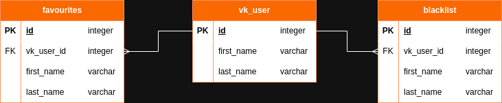

# VKinter - бот для поиска новых знакомств в ВКонтакте
> Бот помогает найти пользователю новые знакомства в своем городе  
> Бот подбирает подходящих пользователей ВК на основе их возраста, пола, статуса и семейного положения  
> В чат последовательно присылаются карточки найденных пользователей, включающие информацию о них:
> - имя и фамилия
> - ссылка на профиль
> - несколько наиболее популярных фотографий  
#### > Функционал бота позволяет:
> - найти подходящих для знакомства пользователей ВК на основе профиля
> - добавить понравившегося пользователя в избранное
> - получить список избранных пользователей
> - добавить пользователя в черный список для исключения из поиска
> - настроить параметры поиска
#### > Технологии и инструменты
> - База данных PostgreSQL
> - VK API

- [Начало работы](#start)
  - [Чувствительная информация и окружение](#environment)
  - [Зависимости](#dependencies)
- [Работа бота](#bot)
  - [Получение информации о профиле](#profile)
  - [Поиск подходящих пользователей](#search)
  - [Взаимодействие с базой данных](#database)
  - [Изменение настроек поиска](#settings)

## 1. Начало работы

* Перед запуском бота необходимо:
>- создать группу (сообщество) ВК  
>- получить id группы
>- в настройках группы включить возможности ботов (дополнительно разрешить добавлять сообщество в чаты)
>- в настройках группы в разделе "Работа с API" включить Long Poll API
>- получить токен бота ВК для доступа к функциям бота
>- получить токен VK API для доступа к функциям API  

_Все эти данные необходимы для работы бота и подготовке переменной окружения (.env). Читайте ниже._

### 1.1. Чувствительная информация и окружение

* Вся чувствительная информация, необходимая для работы бота, должна храниться в переменной окружения (.env)  

_Список хранимых данных:_
   >- TOKEN - токен ВК бота  
   >- GROUP_ID - id группы ВК  
   >- API_TOKEN - токен VK API  
   >- DB_NAME - имя базы данных  
   >- DIALECT - используемая база данных (postgresql)  
   >- USERNAME - имя пользователя для подключения к базе данных
   >- PASSWORD - пароль пользователя для подключения к базе данных
   >- PORT - номер порта (по умолчанию 5432)
   >- URL - url базы данных (по умолчанию localhost)

### 1.2. Зависимости

* Перед запуском бота убедитесь, что у вас установлены все необходимые зависимости: `psycopg2-binary`, `python-dotenv`, `requests`, `SQLAlchemy` и `vk-api`.
    
_Используйте файл `requirements.txt` в корне проекта_

## 2. Работа бота

* Если вы проделали все предыдущие шаги, то бот готов к запуску.

_Алгоритм работы бота следующий:_
> 1. После приветствия и нажатии на кнопку "Начать" бот выполняет поиск подходящих пользователей для знакомств основываясь
> на информации в профиле пользователя, использующего бот.  
> При этом учитываются несколько факторов кандидатов:
>    - город проживания
>    - возраст
>    - пол
>    - семейное положение (статус)

> 2. После того как бот нашел подходящих кандидатов, бот последовательно отправляет их в чат по запросу.  
> Информация о кандидатах присылается в виде карточек пользователя в формате:
>    - имя и фамилия
>    - ссылка на профиль
>    - несколько самых популярных фотографий
>    
>   После чего предлагаются два варианта действия:
>    - добавить кандидата в избранное
>    - добавить кандидата в черный список для дальнейшего его исключения из поиска.  

> 3. Бот сохраняет информацию о пользователе, его избранное и черный список в базу данных и при запросе извлекает ее с базы.  
> Пользователь может запросить у бота список избранных кандидатов, которая извлекается с базы данных в формате:
>    - имя и фамилия кандидата
>    - профиль кандидата

> 4. Бот позволяет пользователю изменять настройки поиска и поддерживает функции:  
> `снижение возраста при поиске`, `увеличение возраста при поиске`, `включить/выключить blacklist при поиске`, `сброс всех настроек`.

### 2.1. Получение информации о профиле

* Бот получает информацию о профиле пользователя используя VK API. Используется функция `vk_api.account.getProfileInfo` с параметром `user_id`.  

_Требуется валидный токен VK API иначе вызов приведет к возбуждению исключения `vk_api.exceptions.ApiError`_

### 2.2. Поиск подходящих пользователей

* Поиск подходящих кандидатов выполняется с использованием VK API. Используется функция `vk_api.users.search` с фильтром по возрасту, полу, городу и наличии фото.  
* В дальнейшем список фильтруется по семейному положению (статусу) и черному списку.  
* У подходящих кандидатов бот запрашивает список фотографий с помощью VK API. Используется функция `vk_api.photos.get` с параметрами `owner_id` и `album_id`. 
* Извлекаются наиболее популярные фотографии по количеству лайков.  

_Требуется валидный токен VK API иначе вызов приведет к возбуждению исключения `vk_api.exceptions.ApiError`_

## 2.3. Взаимодействие с базой данных

* При запуске бота выполняется поиск пользователя в базе данных, если не найден, то бот создает нового.  
* При старте поиска с базы данных подгружаются вся информация о пользователе.  
* База данных хранит информацию о пользователях, его избранных кандидатах и черном списке.  
* ER-диаграмма сущностей представлена на схеме ниже.  

## 2.4. Изменение настроек поиска

* При нажатии на кнопку "Настройки" пользователю станут доступны изменения настроек поиска:
>    - изменение диапазона возраста при поиске `снизить возраст поиска`, `поднять возраст поиска`  
>    - включить/выключить blacklist при поиске `игнорировать черный список`  
>    - вернуться к базовым настройкам `сбросить все настройки`.

---
Авторы:
[InnCent](https://github.com/InnokentiyKim/),
[Nick](https://github.com/hamelumster)
